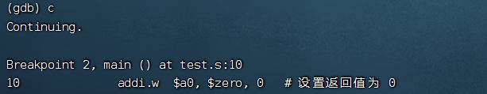

# 龙芯扩展实验ABI文档
- [龙芯扩展实验ABI文档](#龙芯扩展实验ABI文档)
  - [0. 前言](#前言)
  - [1. 基础指令介绍](#基础指令介绍)
    - [1.1 指令编码格式](#指令编码格式)
    - [1.2 整数指令概述](#基础整数指令概述)
    - [1.3 浮点数指令概述](#基础浮点数指令概述)
  - [2. 寄存器使用约定](#寄存器使用约定)
  - [3. 函数调用约定](#函数调用约定)
## 前言

龙芯面向国家信息化建设需求,提供了高性能的处理器和基础软硬件解决方案,并提供独立自主的指令系统架构。龙芯架构LoongArch64是一种精简指令集(RISC)风格的指令系统架构,龙芯架构具有RISC指令架构的典型特征。它的指令长度固定且编码格式规整,绝大多数指令只有两个源操作数和一个目的操作数,采用`load/store`架构,即仅有`load/store`访存指令可以访问内存,其它指令的操作对象均是处理器核内部的寄存器或指令码中的立即数。 

关于更多关于龙芯架构的详细介绍,也可以前往[龙芯官网](https://www.loongson.cn/)等查看相关内容。


## 基础指令介绍

### 指令编码格式

龙芯架构中的所有指令均采用32位固定长度,且指令的地址都要求4字节边界对齐；如下，为某个汇编程序进入函数体时,首条汇编指令及后2条指令的地址,可见指令的地址按照4字节边界对齐：

```
==> 0x120000660 <main+0>:        addi.d $r3,$r3,-32
    0x120000664 <main+4>:        st.d   $r22,$r3,24
    0x120000668 <main+8>:        addi.d $r22,$r3,32
```
#### 基本数据类型
下表为基础指令涉及到的基本数据类型的大小与数据存放时对齐:

   <table>
    <tr>
        <th>Type</th><th>Size</th><th>Alignment</th>
    </tr>
    <tr>
        <td>unsigned/signed char</td><td>1</td><td>1</td>
    </tr>
        <tr>
        <td>unsigned/signed short</td><td>2</td><td>2</td>
    </tr>
        <tr>
        <td>unsigned/signed int</td><td>4</td><td>4</td>
    </tr>
        <tr>
        <td>unsigned/signed long</td><td>8</td><td>8</td>
    </tr>
        <tr>
        <td>unsigned/signed long long</td><td>8</td><td>8</td>
    </tr>
        <tr>
        <td>pointer</td><td>8</td><td>8</td>
    </tr>
        <tr>
        <td>float</td><td>4</td><td>4</td>
    </tr>
        <tr>
        <td>double</td><td>8</td><td>8</td>
    </tr>
        <tr>
        <td>long double</td><td>8</td><td>8</td>
    </tr>
</table>


#### 指令汇编助记格式

指令名后缀为`.B、.H、.W、.D、.BU、.HU、.WU、.DU`分别表示该指令操作的数据类型是有符号字节、有符号半字、有符号字、有符号双字、无符号字节、无符号半字、无符号字、无符号双字。不过这里有一种特殊情况,当操作数是有符号数还是无符号数不影响运算结果时,指令名中携带的后缀均不带U,但此时并不限制操作对象只能是有符号数。
对于操作对象是浮点数类型的,或者更具体来说是那些指令名以“F”、“VF”和“XVF”开头的指令,其指令名后缀为`.H、.S、.D、.W、.L、.WU、.LU`分别表示该指令操作的数据类型是半精度浮点数、单精度浮点数、双精度浮点数、有符号字、有符号双字、无符号字、无符号双字。

#### 基础指令寄存器

基础整数指令涉及的寄存器包括通用寄存器(General-purpose Register,简称GR)、程序计数器(Program Counter, 简称PC,它存放当前将要执行的指令所在的地址,一般我们不需要修改)。

##### 通用寄存器 
通用寄存器GR有32个,记为r0-r31,其中第0号寄存器r0的值恒为0。GR的位宽记作GRLEN。LA32架构下GR的位宽是32比特,LA64架构下GR的位宽是64比特。基础整数指令中任一个寄存器操作数都可以采用32个GR中的任一个。唯一的例外是BL指令中隐含的目的寄存器一定是第1号寄存器r1。在标准的龙芯架构应用程序二进制接口 (Application Binary Interface,简称ABI)中,r1固定作为存放函数调用返回地址的寄存器。 

### 基础整数指令概述

#### 数据传送指令
- 整型的数据传送,可以通过[OR、ORI](#AND,OR,NOR,XOR,ANDN,ORN),或者[LU12I.W](#LU12I.W)等指令实现。
- 样例：
    - 我们可以通过执行如下命令,将\$r12的值赋给\$r13。
        ```
        #$r13=$r12
        #将$r12中数据与$0中的数据进行按位逻辑或运算,结果写入$r13
        or  $r13,$r12,$r0    #$r0中的值恒为0
        ```
     - 如果我们想要传送超过12位的立即数,如让\$r13的`[31:0]`位内容变为56995821(0x365afed)：
        则可以通过以下指令,将该值赋给临时寄存器$r13；
        ``` 
        #56991744,转换为十六进制即0x365a000
        lu12i.w $r12,56991744>>12           #将寄存器$r12的[31:0]位，置为#0x365a000
        ori $r13,$r12,4077                  #将0x365a000与0x0000fed作或操作后，存入$r13
        ```
        
#### 算数运算指令


###### ADD.{W/D},SUB.{W/D}
- 格式：
    - add.w rd,rj,rk        
    - add.d rd,rj,rk
    - sub.w rd,rj,rk
    - sub.d rd,rj,rk
- 概述：
    - ADD.W:
        - ADD.W将通用寄存器rj中的`[31:0]`位数据加上通用寄存器rk中的`[31:0]`位数据,所得结果的`[31:0]`位符号扩展后写入通用寄存器rd中。
    - SUB.W:
        - SUB.W将通用寄存器rj中的`[31:0]`位数据减去通用寄存器rk中的`[31:0]`位数据,所得结果的`[31:0]`位符号扩展后写入通用寄存器rd中。 
    - ADD.D：
        - ADD.D将通用寄存器rj中的`[63:0]`位数据加上通用寄存器rk中的`[63:0]`位数据,所得结果的`[63:0]`位写入通用寄存器rd中。     
    - SUB.D：
        - SUB.D将通用寄存器rj中的`[63:0]`位数据减去通用寄存器rk中的`[63:0]`位数据,所得结果的`[63:0]`位写入通用寄存器rd中。
    - 上述指令执行时不对溢出作特殊处理。
- 样例：
    - 执行指令前, \$r13寄存器的值为`0x0000000000000003`,\$r12寄存器的值为 `0x0000000000000005`。
        ```
        sub.w   $r14,$r13,$r12
        ```
        执行后,\$r14 寄存器的值为`0xfffffffffffffffe`,即其`[31:0]`位数据等于`-2`。

###### ADDI.{W/D}
- 格式:
    - addi.w rd,rj,si12
    - addi.d rd,rj,si12    
- 概述：
    - ADDI.W:
        - ADDI.W将通用寄存器rj中的`[31:0]`位数据加上12比特立即数si12符号扩展后的32位数据,所得结果的`[31:0]`位符号扩展后写入通用寄存器rd中。    
    - ADDI.D：
        - ADDI.D将通用寄存器rj中的`[63:0]`位数据加上12比特立即数si12符号扩展后的64位数据,所得结果的`[63:0]`位写入通用寄存器rd中。     
    - 上述指令执行时不对溢出作特殊处理。
- 样例：
    - 寄存器\$sp中的值`0x000000ffffff33f0`;执行指令
        ```
        addi.d  $fp,$sp,32
        ```
        执行后,\$fp 寄存器的值为`0x000000ffffff3410`。     

##### LU12I.W
- 格式:
    - lu12i.w rd,si20
- 概述：
    - LU12I.W:
        - LU12I.W将20比特立即数si20位连接上12比特0,然后符号扩展后写入通用寄存器rd中。 
    - 该指令与ORI指令一起,用于将超过12位的立即数装入通用寄存器中。
    
##### SLT
- 格式:
    - slt rd,rj,rk
- 概述：
    - SLT:
        - SLT将通用寄存器rj中的数据与通用寄存器rk中的数据视作有符号整数进行大小比较,如果前者小于后者,则将通用寄存器rd的值置为1,否则置为0。  
    - SLT比较的数据位宽与所执行机器的通用寄存器位宽一致。

##### SLTI
- 格式:
    - slti rd,rj,si12
- 概述：
    - SLTI:
        - SLTI将通用寄存器rj中的数据与12比特立即数si12符号扩展后得到的数据视作有符号整数进行大小比较,如果前者小于后者,则将通用寄存器rd的值置为1,否则置为0。 
    - SLTI比较的数据位宽与所执行机器的通用寄存器位宽一致。    

##### AND,OR,NOR,XOR,ANDN,ORN
- 格式:
    - and rd, rj, rk
    - or rd, rj, rk
    - nor rd, rj, rk
    - xor rd, rj, rk
    - andn rd, rj, rk
    - orn rd, rj, rk
- 概述：
    - AND:
        - AND将通用寄存器rj中数据与通用寄存器rk中的数据进行按位逻辑与运算,结果写入通用寄存器rd中。    
    - OR:
        - OR将通用寄存器rj中数据与通用寄存器rk中的数据进行按位逻辑或运算,结果写入通用寄存器rd中。
    - NOR:
        - NOR将通用寄存器rj中数据与通用寄存器rk中的数据进行按位逻辑或非运算,结果写入通用寄存器rd中。
    - XOR:
        - XOR将通用寄存器rj中数据与通用寄存器rk中的数据进行按位逻辑异或运算,结果写入通用寄存器rd中。 
    - ANDN:
        - ANDN将通用寄存器rk中数据按位取反后再与通用寄存器rj中的数据进行按位逻辑与运算,结果写入通用寄存器rd中。
    - ORN:
        - ORN将通用寄存器rk中数据按位取反后再与通用寄存器rj中的数据进行按位逻辑或运算,结果写入通用寄存器rd中。
    - 上述指令操作的数据位宽与所执行机器的通用寄存器位宽一致。    
##### ANDI,ORI,XORI
- 格式:
    - andi rd, rj, ui12  
    - ori rd, rj, ui12
    - xori rd, rj, ui12
- 概述：
    - ANDI:
        - ANDI将通用寄存器rj中数据与12比特立即数ui12零扩展之后的数据进行按位逻辑与运算,结果写入通用寄存器rd中。    
    - ORI:
        - ORI将通用寄存器rj中数据与12比特立即数ui12零扩展之后的数据进行按位逻辑或运算,结果写入通用寄存器rd中。   
    - XORI:
        - XORI将通用寄存器rj中数据与12比特立即数ui12零扩展之后的数据进行按位逻辑异或运算,结果写入通用寄存器rd中。 
    - 上述指令操作的数据位宽与所执行机器的通用寄存器位宽一致。    
##### NOP
- 概述：       
    - NOP指令是`"andi,r0,r0,0"`的别名,其作用仅为占据4字节的指令码位置并让PC+4,除此之外不会改变任何软件可见的处理器状态。(注意\$r0寄存器的值始终为0)
      
##### MUL.W,MULH.W
- 格式:
    - mul.w rd, rj, rk
    - mulh.w rd, rj, rk
- 概述：
    - MUL.W:
        - MUL.W将通用寄存器rj中[31:0]位数据与通用寄存器rk中[31:0]位数据相乘,乘积结果的[31:0]位数据符号扩展后写入通用寄存器rd的[63:0]位中。    
    - MULH.W:
        - MULH.W将通用寄存器rj中[31:0]位数据与通用寄存器rk中[31:0]位数据视作有符号数相乘,乘积结果的[63:32]位数据符号扩展后写入通用寄存器rd的[63:0]位中。     
##### MULW.D.W
- 格式:
    - mulw.d.w, rj, rk
- 概述：
    - MULW.D.W:
        - MULW.D.W将通用寄存器rj中[31:0]位数据与通用寄存器rk中[31:0]位数据视作有符号数相乘,乘积结果的[63:0]位数据写入通用寄存器rd中。    
        
##### DIV.W,MOD.W
- 格式:
    - div.w rd, rj, rk
    - mod.w rd, rj, rk

- 概述：
    - DIV.W:
        - DIV.W将通用寄存器rj中[31:0]位数据除以通用寄存器rk中[31:0]位数据,所得的商符号扩展后写入通用寄存器rd中。    
    - MOD.W:
        - MOD.W和MOD.WU将通用寄存器rj中[31:0]位数据除以通用寄存器rk中[31:0]位数据,所得的余数符号扩展后写入通用寄存器rd中。
    - 在LoongArch64兼容的机器上,执行DIV.W和MOD.W指令时,如果通用寄存器rj和rk中的数值超过了32位有符号数的数值范围,则执行结果可以是无意义的任意值。    
    - DIV.W、 MOD.W进行除法操作时,操作数均视作有符号数。 
    - 求商／余数的指令对DIV.W/MOD.W运算的结果满足,余数与被除数的符号一致且余数的绝对值小于除数的绝对值。 
    - 当除数是0时,结果可以为任意值。 

#### 移位运算类指令

##### SLLI.W,SRLI.W,SRAI.W,ROTRIW
- 格式:
    - slli.w rd, rj, ui5
    - srli.w rd, rj, ui5
    - srai.w rd, rj, ui5
    - rotri.w rd, rj, ui5
- 概述：
    - 下述移位指令的移位量均为指令码中5比特无符号立即数ui5。
    - SLLI.W:
        - SLLI.W将通用寄存器rj中[31:0]位数据逻辑左移,所得的移位结果符号扩展后写入通用寄存器rd中。                 
    - SRLI.W:
        - SRLI.W将通用寄存器rj中[31:0]位数据逻辑右移,所得的移位结果符号扩展后写入通用寄存器rd中。  
    - SRAI.W:
        - SRAI.W将通用寄存器rj中[31:0]位数据算数右移,所得的移位结果符号扩展后写入通用寄存器rd中。  
    - ROTRI.W:
        - ROTRI.W将通用寄存器rj中[31:0]位数据循环右移,所得的移位结果符号扩展后写入通用寄存器rd中。
- 样例：
    - 若\$r12寄存器在执行指令前,其内容为`0xfffffffffffffffa`,即`[31:0]`位数据的值等于-6。并执行移位指令：
        ```
          slli.w  $r12,$r12,1
        ```
        执行后,\$r12 寄存器的值为`0xfffffffffffffff4`,即其`[31:0]`位数据的值等于-12,`[63:32]`位根据左移结果全置为1。
    - 同上,若\$r12寄存器在执行指令前,其内容为 `0xfffffffffffffffa`,并执行移位指令：
        ```
          srli.w  $r12,$r12,1
        ```
        执行后,\$r12 寄存器的值为`000000007ffffffd`,即逻辑右移后左边补0,`[63:32]`位根据移位结果全置为0。  
    
##### SLL.W,SRL.W,SRA.W,ROTR.W
- 格式:
    - sll.w rd, rj, rk
    - srl.w rd, rj, rk
    - sra.w rd, rj, rk
    - rotr.w rd, rj, rk
- 概述：
    - 下述移位指令的移位量均为通用寄存器rk中[4:0]位数据,且视作无符号数。
    - SLL.W:
        - SLL.W将通用寄存器rj中[31:0]位数据逻辑左移,所得的移位结果符号扩展后写入通用寄存器rd中。 
    - SRL.W:
        - SRL.W将通用寄存器rj中[31:0]位数据逻辑右移,所得的移位结果符号扩展后写入通用寄存器rd中。  
    - SRA.W:
        - SRA.W将通用寄存器rj中[31:0]位数据算数右移,所得的移位结果符号扩展后写入通用寄存器rd中。  
    - ROTR.W:
        - ROTR.W将通用寄存器rj中[31:0]位数据循环右移,所得的移位结果符号扩展后写入通用寄存器rd中。

##### SLLI.D,SRLI.D,SRAI.D,ROTRI.D
- 格式:
    - slli.d rd, rj, ui6
    - srli.d rd, rj, ui6
    - srai.d rd, rj, ui6
    - rotri.d rd, rj, ui6
- 概述：
    - SLLI.D:
        - SLLI.D将通用寄存器rj中[63:0]位数据逻辑左移,所得的移位结果符号扩展后写入通用寄存器rd中。       
    - SRLI.D:
        - SRLI.D将通用寄存器rj中[63:0]位数据逻辑右移,所得的移位结果符号扩展后写入通用寄存器rd中。  
    - SRAI.D:
        - SRAI.D将通用寄存器rj中[63:0]位数据算数右移,所得的移位结果符号扩展后写入通用寄存器rd中。  
    - ROTRI.D:
        - ROTRI.D将通用寄存器rj中[63:0]位数据循环右移,所得的移位结果符号扩展后写入通用寄存器rd中。
    - 上述移位指令的移位量均为指令码中6比特无符号立即数ui6。  

##### SLL.D,SRL.D,SRA.D,ROTR.D
- 格式:
    - sll.d rd, rj, rk
    - srl.d rd, rj, rk
    - sra.d rd, rj, rk
    - rotr.d rd, rj, rk
- 概述：
    - SLL.D:
        - SLL.D将通用寄存器rj中[63:0]位数据逻辑左移,所得的移位结果符号扩展后写入通用寄存器rd中。       
    - SRL.D:
        - SRL.D将通用寄存器rj中[63:0]位数据逻辑右移,所得的移位结果符号扩展后写入通用寄存器rd中。  
    - SRA.D:
        - SRA.D将通用寄存器rj中[63:0]位数据算数右移,所得的移位结果符号扩展后写入通用寄存器rd中。  
    - ROTR.D:
        - ROTR.D将通用寄存器rj中[63:0]位数据循环右移,所得的移位结果符号扩展后写入通用寄存器rd中。
    - 上述移位指令的移位量均为通用寄存器rk中[5:0]位数据,且视作无符号数。 
      ​                             
#### 转移指令
##### 示例
- [示例二](###示例2)给出了分支指令`B`的使用参考。
- [示例三](###示例3)给出了过程调用中`BL`和`JIRL`的使用参考。
##### B                       
- 格式：
    - b offs26
- 概述：
    - B
      - B无条件跳转到目标地址处。其跳转目标地址是将指令码中的26比特立即数offs26逻辑左移2位后再符号扩展,所得的偏移值加上该分支指令的PC。
    - 需要注意的是,该指令如果在写汇编时采用直接填入偏移值的方式,则汇编表示中的立即数应填入以字节为单位的偏移值,即指令码中offs26<<2。

##### BL
- 格式：
    - bl offs26
- 概述：
    - BL
      - BL无条件跳转到目标地址处。同时将该指令的PC值加4的结果写入1号通用寄存器r1中。其跳转目标地址是将指令码中的26比特立即数offs26逻辑左移2位后再符号扩展,所得的偏移值加上该分支指令的PC。 
    - 1号通用寄存器r1作为返回地址寄存器ra。
    - 该指令通常配合JIRL指令,完成函数调用。
    - 需要注意的是,该指令如果在写汇编时采用直接填入偏移值的方式,则汇编表示中的立即数应填入以字节为单位的偏移值,即指令码中offs26<<2。       
##### JIRL
- 格式：
    - jirl rd,rj,offs16
- 概述：
    - JIRL
      - JIRL无条件跳转到目标地址处。同时将该指令的PC值加4的结果写入通用寄存器rd中。其跳转目标地址是将指令码中的16比特立即数offs16逻辑左移2位后再符号扩展,所得的偏移值加上通用寄存器rj的值。 
    - 当rd等于0时,JIRL的功能即是一条普通的非调用间接跳转指令。 rd等于0,rj等于1且offs16等于0的JIRL常作为调用返回间接跳转使用。
    - 需要注意的是,该指令如果在写汇编时采用直接填入偏移值的方式,则汇编表示中的立即数应填入以字节为单位的偏移值,即指令码中offs16<<2。  
- 样例：
    - 伪指令`jr $r1`是一条宏指令,它的完整表示为：
        ```
         jirl    $r0,$r1,0
        ```
        其功能为跳转到寄存器$r1所保存的地址,该指令常用于过程返回。      
##### BEQ,BNE,BLT[U],BGE[U]
- 格式:
    - beq rj, rd, offs16
    - bne rj, rd, offs16
    - blt rj, rd, offs16
    - bge rj, rd, offs16
    - bltu rj, rd, offs16
    - bgeu rj, rd, offs16

- 概述：
    - BEQ
      - BEQ将通用寄存器rj和通用寄存器rd的值进行比较,如果相等则跳转到目标地址,否则不跳转。 
    - BNE
      - BNE将通用寄存器rj和通用寄存器rd的值进行比较,如果不相等则跳转到目标地址,否则不跳转。
    - BLT
      - BLT将通用寄存器rj和通用寄存器rd的值视作有符号数进行比较,如果前者小于后者则跳转到目标地址,否则不跳转。
    - BGE
      - BGE将通用寄存器rj和通用寄存器rd的值视作有符号数进行比较,如果前者大于后者则跳转到目标地址,否则不跳转。    
    - BLTU
      - BLTU将通用寄存器rj和通用寄存器rd的值视作无符号数进行比较,如果前者小于后者则跳转到目标地址,否则不跳转。
    - BGEU
      - BGEU将通用寄存器rj和通用寄存器rd的值视作无符号数进行比较,如果前者大于后者则跳转到目标地址,否则不跳转。    
    - 上述六条分支指令的跳转目标地址计算方式是将指令码中的16比特立即数offsl6逻辑左移2位后再符号扩展,所得的偏移值加上该分支指令的PC。不过需要注意的是,上述指令如果在写汇编时采用直接填入偏移值的方式,则汇编表示中的立即数应填入以字节为单位的偏移值,即指令码中offs16<<2。 
            
##### BEQZ,BNEZ
- 格式：
    - beqz rj, offs21
    - bnez rj, offs21
- 概述：
    - BEQZ
      - BEQZ对通用寄存器rj的值进行判断,如果等于0则跳转到目标地址,否则不跳转。 
    - BNEZ
      - BNEZ对通用寄存器rj的值进行判断,如果不等于0则跳转到目标地址,否则不跳转。
      - 上述两条分支指令的跳转目标地址计算方式是将指令码中的21比特立即数offs21逻辑左移2位后再符号扩展,所得的偏移值加上该分支指令的PC。 不过需要注意的是,上述指令如果在写汇编时采用直接填入偏移值的方式,则汇编表示中的立即数应填入以字节为单位的偏移值,即指令码中offs21<<2。 
        
#### 普通访存指令
##### LD.{B/H/W/D},ST.{B/H/W/D}
- 格式：
    - ld.b rd, rj, si12
    - ld.h rd, rj, si12
    - ld.w rd, rj, si12
    - ld.d rd, rj, si12
    - st.b rd, rj, si12
    - st.h rd, rj, si12
    - st.w rd, rj, si12
    - st.d rd, rj, si12

- 概述：
    - LD.{B/H/W}从内存取回一个字节／半字／字的数据符号扩展后写入通用寄存器rd, LD.D从内存取回一个双字的数据写入通用寄存器rd。      

    - ST.{B/H/W/D}将通用寄存器rd中的[7:0]/[15:0]/[31:0]/[63:0]位数据写入内存中

    -   上述指令的访存地址计算方式是将通用寄存器rj中的值与符号扩展后的12比特立即数Si12相加求和。

#### 宏指令 
##### LA.LOCAL
- 格式:
   - la.local rd, label 
- 概述：
    - 将定义在模块内的符号,比如全局变量,加载到通用寄存器rd中。        
### 基础浮点数指令
本章将介绍龙芯架构非特权子集基础部分中的浮点数指令。
#### 浮点数据类型
龙芯架构中的基础浮点数指令的功能定义遵循IEEE 754-2008标准。 
##### 定点数据类型 
部分浮点指令（如浮点转换指令)也会操作定点数据,包括字（Word,简记W,长度32b)、长字 (Longword,简记L,长度64b)。 字和长字数据类型均采用二进制补码的编码方式。 
##### 寄存器 
浮点数指令编程涉及到寄存器有浮点寄存器（Floating-point Register,简称FR)、条件标志寄存器 (Condition Flag Register,简称CFR)。
- FR:
  - 浮点寄存器共有32个,记为f0-f31,每一个都可以读写。仅当只实现操作单精度浮点数和字整数的浮点指令时,FR的位宽为32比特。通常情况下,FR的位宽为64比特,无论是LA32还是LA64架构。基础浮点数指令与浮点寄存器存在正交关系,即从架构角度而言,这些指令中任一个浮点寄存器操作数都可以采用32个FR中的任一个。
  - 当浮点寄存器记录的是一个单精度浮点数或字整数时,数据总会出现在浮点寄存器的[31:0]位上,此时浮点寄存器的[63:32]位可以是任意值。
  
- CFR:
  - 条件标志寄存器CFR共有8个,记为fcc0-fcc7,每一个都可以读写。CFR的位宽为1比特。浮点比较的结果将写入到条件标志寄存器中,当比较结果为真则置1,否则置0。浮点分支指令的判断条件来自于条件标志寄存器。 


### 基础浮点指令概述
#### 样例
-   [示例四](###示例4)，给出了浮点搬运指令movgr2fr，浮点转换指令ffint、浮点比较指令fcmp等浮点指令的使用参考。
-   [示例五](###示例5)，给出了浮点数的赋值指令使用参考。
#### 浮点运算类指令

##### F{ADD/SUB/MUL/DIV}.{S/D}
- 格式:
  - fadd.s fd, fj, fk 
  - fadd.d fd, fj, fk
  - fsub.s fd, fj, fk 
  - fsub.d fd, fj, fk
  - fmul.s fd, fj, fk 
  - fmul.d fd, fj, fk
  - fdiv.s fd, fj, fk 
  - fdiv.d fd, fj, fk
- 概述:
  - FADD.{S/D}指令将浮点寄存器fj中的单精度/双精度浮点数加上浮点寄存器fk中的单精度/双精度浮点数,得到的单精度/双精度浮点数结果写入到浮点寄存器fd中。浮点加法运算遵循IEEE 754-2008标准 中addition (x,y)操作的规范。
  - FSUB.{S/D}指令将浮点寄存器fj中的单精度/双精度浮点数减去浮点寄存器fk中的单精度/双精度浮点数,得到的单精度/双精度浮点数结果写入到浮点寄存器fd中。浮点减法运算遵循IEEE 754-2008标准中 subtraction(x,y)操作的规范。 
  - FMUL.{S/D}指令将浮点寄存器fj中的单精度/双精度浮点数乘以浮点寄存器fk中的单精度/精度浮点数,得到的单精度/双精度浮点数结果写入到浮点寄存器fd中。浮点乘法运算遵循IEEE 754-2008标准中 multiplication(x,y)操作的规范。  
  - FDIV.{S/D}指令将浮点寄存器fj中的单精度/双精度浮点数除以浮点寄存器fk中的单精度/双精度浮点数,得到的单精度/双精度浮点数结果写入到浮点寄存器fd中。浮点乘法运算遵循IEEE 754-2008标准中 division(x,y)操作的规范。 
  - 当操作数是单精度浮点数时,结果浮点寄存器的高32位可以是任意值。

#### 浮点比较指令
##### FCMP.cond.{S/D}
- 格式:
  - fcmp.cond.s cc, fj, fk
  - fcmp.cond.d cc, fj, fk
- 概述:
    - 这是一条浮点比较指令,将比较结果写入状态码。其中助记符(cond)为编写汇编代码时的判断标志，状态码为可选的条件标志寄存器，比较条件和判断标准如下:
    -    <table>
    <tr>
        <th>助记符/Cond</th><th>状态码</th><th>含义</th><th>True Condition</th>
    </tr>
    <tr>
        <td>CAF</td><td>0x0</td><td>否</td><td>无</td>
    </tr>
    <tr>
        <td>CUN</td><td>0x8</td><td>无法比较</td><td>UN</td>
    </tr>
    <tr>
        <td>CEQ</td><td>0x4</td><td>相等</td><td>EQ</td>
    </tr>
    <tr>
        <td>CUEQ</td><td>0xC</td><td>相等或无法比较</td><td>UN EQ</td>
    </tr>
    <tr>
        <td>CLT</td><td>0x2</td><td>小于</td><td> LT</td>
    </tr>
    <tr>
        <td>CULT</td><td>0xA</td><td>小于或者无法比较</td><td>UN LT</td>
    </tr>    
    <tr>
        <td>CLE</td><td>0x6</td><td>小于等于</td><td>EQ LT</td>
    </tr>
    <tr>
        <td>CULE</td><td>0xE</td><td>小于等于或无法比较</td><td>UN EQ LT</td>
    </tr>
        <tr>
        <td>CNE</td><td>0x10</td><td>不等</td><td>GT LT</td>
    </tr>
    <tr>
        <td>COR</td><td>0x14</td><td>有序</td><td>GT LT EQ</td>
    </tr>
        <tr>
        <td>CUNE</td><td>0x18</td><td>无法比较或不等</td><td>UN GT LT</td>
    </tr>
    </table>

#### 浮点转换指令(无)
##### FFINT.S.W,FTINT.W.S
  - ffint.s.w fd, fj   
  - ftint.w.s fd, fj
- 概述:   
  - FFINT.S.W指令选择浮点寄存器fj中的整数型定点数转换为单精度浮点数, 得到的单精度浮点数写入到浮点寄存器fd中。
  - FTINT.W.S指令选择浮点寄存器fj中的单精度浮点数转换为整数型定点数, 得到的整数型定点数写入到浮点寄存器fd中。
#### 浮点分支指令
##### BCEQZ,BCNEZ
- 格式:
  - bceqz cj, offs21
  - bcnez cj, offs21
- 概述:
   -  BCEQZ对条件标志寄存器cj的值进行判断,如果等于0则跳转至目标地址,否则不跳转。 
   -  BCNEZ对条件标志寄存器cj的值进行判断,如果不等干0则跳转到目标地址,否则不跳转。 
   - 上述两条分支指令的跳转目标地址是将指令码中的21比特立即数。ffs21逻辑左移2位后再符号扩展所得的偏移值加上该分支指令的PC。不过需要注意的是,上述指令如果在写汇编时采用直接填入偏移值的方式,则汇编表示中的立即数应填入以字节为单位的偏移值,即指令码中offs21<<2。 
#### 浮点搬运指令
##### FMOV.{S/D}
- 格式:
  - fmov.s fd, fj 
  - fmov.d fd, fj 
- 概述:
   -  FMOV.{S/D}将浮点寄存器fj的值按单精度／双精度浮点数格式写入到浮点寄存器fd中,如果fj的值不是单精度／双精度浮点数格式,则结果不确定。
   
##### MOVGR2FR.{W/D},MOVGR2FRH.W
- 格式:
  - movgr2fr.w fd, rj 
  - movgr2fr.d fd, rj
  - movgr2frh.w fd, rj
- 概述:
   -  MOVGR2FR.W将通用寄存器rj的低32位值写入浮点寄存器fd的低32位中。若浮点寄存器位宽为64位,则fd的高32位值不确定。
   -  MOVGR2FRH.W将通用寄存器rj的低32位值写入浮点寄存器fd的高32位中,浮点寄存器fd的低32位值不变。
   -  MOVGR2FR.D将通用寄存器rj的64位值写入浮点寄存器fd。
##### MOVFR2GR.{S/D},MOVFRH2GR.S
- 格式:
  - movfr2gr.s rd, fj 
  - movfr2gr.d rd, fj
  - movfrh2gr.s rd, fj
- 概述:
   -  MOVFR2GR/MOVFRH2GR.S将浮点寄存器fj的低32位／高32位值符号扩展后写入通用寄存器rd。
   -  MOVFR2GR.D将浮点寄存器fj的64位值写入通用寄存器rd。        
#### 浮点访存指令
##### FLD.{S/D},FST.{S/D}
- 格式:
  - fld.s fd, rj, si12 
  - fld.d fd, rj, si12
  - fst.s fd, rj, si12 
  - fst.d fd, rj, si12

- 概述:
   -  FLD.S从内存取回一个字的数据写入浮点寄存器fd的低32位。若浮点寄存器位宽为64位,则fd的高32位值不确定。 
   - FLD.D从内存取回一个双字的数据写入浮点寄存器fd。
   - FST.S将浮点寄存器fd中低32位字数据写入到内存中。
   -  FST.D将浮点寄存器fd中双字数据写入到内存中。 
   -  上述指令的访存地址计算方式是将通用寄存器rj中的值与符号扩展后的12比特立即数si12相加求和。 
   
## 寄存器使用约定

### 整形寄存器调用约定   

- [参数传递](###参数传递)节给出了参数传递、调用返回值保存时的具体寄存器调用规范。也可参考[样例](###示例1)对寄存器的使用；

- 表中Name为寄存器名，Alias为别名，便于理解和记忆，在汇编程序中可使用寄存器名、也可使用对应的别名来指代相应寄存器。
- Preserved across calls表示函数调用过程中是否需要由调用者保存，Unused表示该寄存器不应该被汇编代码修改；Yes表示应该由调用者保存；No表示不需要由调用者保存。
   <table>
    <tr>
        <th>Name</th><th>Alias</th><th>Usage</th><th>Preserved across calls</th>
    </tr>
    <tr>
        <td>$r0</td><td>$zero</td><td>Constant Zero</td><td>Unused</td>
    </tr>
    <tr>
        <td>$r1</td><td>$ra</td><td>Return Address</td><td>No</td>
    </tr>
    <tr>
        <td>$r2</td><td>$tp</td><td>TLS</td><td>Unused</td>
    </tr>
    <tr>
        <td>$r3</td><td>$sp</td><td>Stack Pointer</td><td>Yes</td>
    </tr>
    <tr>
        <td>$r4-$r11</td><td>$a0-$a7</td><td>Argument Registers</td><td>No</td>
    </tr>
        <tr>
        <td>$r4-$r5</td><td>$v0-$v1</td><td>Return Value</td><td>No</td>
    </tr> 
        <tr>
        <td>$r12-$20</td><td>$t0-$t8</td><td>Temp Registers</td><td>No</td>
    </tr>
        <tr>
        <td>$r21</td><td>$x</td><td>Reserved</td><td>Unused</td>
    </tr>
        <tr>
        <td>$r22</td><td>$fp</td><td>Frame Pointer</td><td>Yes</td>
    </tr>
    <tr>
        <td>$r23-$r31</td><td>$s0-$s8</td><td>Subroutine register variables</td><td>Yes</td>
    </tr>
</table>

- \$ra 是⼀个临时寄存器。控制流到达callee瞬间的 \$ra 的值是callee的返回地址,且这个值只会被备份在栈帧中。callee返回指令是 jirl \$r0,\$ra,0。

- \$tp ⽤于⽀持 TLS(thread-local storage),\$tp 由c库维护,故⽤户程序不应修改这个寄存器。
- \$sp 在整个程序执⾏过程中恒指向调⽤栈栈顶,是⼀个保存寄存器。控制流到达callee瞬间的\$sp的值被称作 \$sp on entry。
- \$fp 是⼀个保存寄存器,但如果过程的栈帧可变,编译器会使⽤这个寄存器作为 frame pointer(栈帧不变部分的地址加常数偏移量,也指存放该值的寄存器。 \$sp on entry是⼀个frame pointer。栈帧不变的函数的frame pointer是\$sp)。
- Unused指编译器在分配寄存器时,不会去分配该寄存器；或者约定作专⽤寄存器。

### 浮点寄存器调用约定  

- 表中Name为寄存器名，Alias为别名，便于理解和记忆，在汇编程序中可使用寄存器名、也可使用对应的别名来指代相应寄存器。
- Preserved across calls表示函数调用过程中是否需要由调用者保存，Unused表示该寄存器不应该被汇编代码修改；Yes表示应该由调用者保存；No表示不需要由调用者保存。
   <table>
    <tr>
        <th>Name</th><th>Alias</th><th>Usage</th><th>Preserved across calls</th>
    </tr>
    <tr>
        <td>$f0-$f7</td><td>$fa0-$fa7</td><td>Argument Registers</td><td>No</td>
    </tr>
    <tr>
        <td>$f0-$f1</td><td>$fv0-$fv1</td><td>Return Value</td><td>No</td>
    </tr>
    <tr>
        <td>$f8-$f23</td><td>$ft0-$ft15</td><td>Temp Registers</td><td>No</td>
    </tr>
</table>

## 函数调用约定

### 栈帧布局

- 整个函数中,堆栈从高地址增长到低地址。ABI使用两个寄存器来访问堆栈：指向帧底部的帧指针(\%fp),和堆栈指针(\%sp)指向帧的顶部。下图显示了框架的布局。正常情况下,帧指针用于寻址帧中的数据,例如传入参数和本地变量。

- 堆栈指针应该对⻬到⼀个128位的边界上作为函数⼊⼝。在堆栈上传递的第⼀个实参位于函数⼊⼝的堆栈指针偏移量为零的地⽅；后⾯的参数存储在更⾼的地址中。

### 函数调用过程


函数调用的过程由调用者和被调用者共同完成。
#### 调用方调用

调用方的任务包括保存涉及跨调用过程中任何应由调用方保存的寄存器、将参数加载到适当的寄存器和堆栈位置,然后执行跳转指令。
```
bl  function             #bl指令:执行跳转,并将PC+4写入$ra
```
#### 被调用方进入
进入时,被调用方需要初始化其堆栈帧。此初始化由以下顺序完成：
```
addi.d  $sp,$sp,-N          #分配栈帧,注意堆栈指针需要对齐到16字节
st.d    $ra,$sp,N-8         #将返回地址的内容压栈
addi.d  $fp,$sp,N           #赋给$fp当前的栈底值
...
```
这里的N指的是被调用方分配的栈帧大小。

#### 被调用方退出
一旦调用过程完成,被调用方将执行退出。这包括将结果放入对应寄存器,释放堆栈帧,并将控制返回调用方。
```
...
or      $v0,$t0,$r0        #返回结果保存至$v0
ld.d    $ra,$sp,N-8         # 恢复返回地址
addi.d  $sp,$sp,N
jr      $ra                 #根据$ra的地址返回
```

#### 调用方还原
如果调用方在每次调用的基础上为参数分配堆栈空间,那么它负责返回时释放空间。

### 参数传递
#### 整形调用规范
- 基本整型调⽤规范提供了8个参数寄存器a0-a7⽤于参数传递,前两个参数寄存器a0-a1也⽤于返回值；若a0-a7数目不够时,使用栈进行数据传输。
- 若⼀个标量位宽GRLEN(即寄存器宽度,LA64下为64位),则它在单个参数寄存器中传递,若没有可⽤的寄存器,则在堆栈中传递；传递到堆栈上的标量会对⻬到类型对⻬(type alignment)和GRLEN中的较⼤者,但不会超过堆栈对⻬。当整型参数传⼊寄存器或堆栈时,⼩于GRLEN 位的整型标量根据其类型的符号扩展⾄32位,然后符号扩展为GRLEN位。当浮点型参数传⼊寄存器或堆栈时,⽐GRLEN位窄的浮点类型将被扩展为GRLEN位,⽽⾼位为未定义位。
- 通过引⽤传递的实参可以由被调⽤⽅修改。
- 返回值的传递⽅式与第⼀个同类型命名参数的传递⽅式相同。如果这样的实参是通过引⽤传递的,则调⽤者为返回值分配内存,并将地址作为隐式的第⼀个参数传递。
- 函数(procedure)所依赖的数据必须位于函数栈帧范围之内。
  
#### 浮点调用规范
- 浮点参数寄存器共8个,为fa0-fa7,其中fa0和fa1也⽤于传递返回值。需要传递的值在任何可能的情况下都可以传递到浮点寄存器中,与整型参数寄存器a0-a7是否已经⽤完⽆关。
- 若⼀个浮点实数参数不超过FLEN位宽(FLEN指的是ABI中的浮点寄存器的宽度),并且⾄少有⼀个浮点参数寄存器可⽤,则将这个浮点实数参数传递到浮点参数寄存器中。否则,它将根据整型调⽤规范传递。当⼀个⽐FLEN位更窄的浮点参数在浮点寄存器中传递时,它会扩展(NaN-Boxed)到FLEN位。
- 返回值的传递⽅式与传递第⼀个同类型命名参数的⽅式相同。


### 函数值的返回

- 如果返回值类型是pointer或整型scalar type,则返回值经符号扩展或零扩展后放⼊ $v0 中。  
- 如果返回值类型是float或double,则返回值在 $fv0 中。

## LA64汇编概述与示例

### 示例1

源程序

```c
int main() {
    return 0;
}
```

汇编代码             

```c
    .text                   # 标记代码段
    .globl  main            # 标记 main 全局可见（必需）
    .type   main, @function # 标记 main 是一个函数
main:                       # 标记程序入口
    addi.d  $sp, $sp, -16   # 分配栈空间（必需）,-16为16字节
    st.d    $ra, $sp, 8     # 保存返回地址（必需）
    addi.d  $fp, $sp, 16    # 设置帧指针

    
    addi.w  $a0, $zero, 0   # 设置返回值为 0
    ld.d    $ra, $sp, 8     # 恢复返回地址（必需）
    addi.d  $sp, $sp, 16    # 释放栈空间（必需）
    jr  $ra                 # 返回调用main函数的父函数（必需）
```
在执行完毕指令`addi.w    $a0, $zero, 0`时,我们通过gdb查看当前函数的栈帧:
```
(gdb) i frame
Stack level 0, frame at 0xffffff3410:
 pc = 0x120000674 in main (test.s:11); saved pc = 0xfff7e80774
 source language asm.
 Arglist at 0xffffff3410, args: 
 Locals at 0xffffff3410, Previous frame's sp is 0xffffff3410
 Saved registers:
  pc at 0xffffff3408
```
可以看到当前\$sp寄存器的内容为0xffffff3400,\$fp的内容为0xffffff3410。

再来查看当前函数栈空间的内容:
```
(gdb) x/4x $sp #从$sp地址开始,向后显示4个单元按16进制格式输出的内容。
0xffffff3400:   0x00000000      0x00000000      0xf7e80774      0x000000ff #可以看到$sp+8 处的内容为0xfff7e80774,即保存的返回地址。
```
可见返回地址通过指令`st.d $ra, $sp, 8`被保存在栈空间中。
此时栈的状态如图。


### 示例2
```c
int a;
int main() {
    a = 4;
    if (a > 0)
        return 1;
    return 0;
}
```
```c
        .text                       # 标记代码段
        .comm   a, 4                # 为符号a分配4字节长度的未初始化内存空间
        .globl  main                # 标记 main 全局可见（必需）
        .type   main, @function     # 标记 main 是一个函数
main:                               # 标记程序入口
        addi.d  $sp, $sp, -16       # 分配栈空间（必需）,-16为16字节
        st.d    $ra, $sp, 8         # 保存返回地址（必需）
        addi.d  $fp, $sp, 16        # 设置帧指针
.main_label_entry:                  # 分支判断入口
        addi.w  $t4, $zero, 4       # t4 = 4
        addi.w  $t2, $zero, 0       # t2 = 0
        la.local $t0, a             # 将a所处的内存地址加载入 t0
        stptr.w $t4, $t0, 0         # 将 t4 的数据保存入 t0 指向的地址中 
        blt $t2, $t4, .main_then0   # 将 t2 和 t4 比较,如果 t2 < t4 则跳转到  main_then0
        b   .main_else1             # 否则跳转到 .main_else1
.main_else1:                    
        addi.w  $a0, $zero, 0       # 设置返回值为 0
        b   .main_label_return      #跳转到 .main_label_return
.main_then0:                    
        addi.w  $a0, $zero, 1       # 设置返回值为 1
        b   .main_label_return      #跳转到 .main_label_return
.main_label_return:                 # 标记分支出口
        ld.d    $ra, $sp, 8         # 恢复返回地址（必需）
        addi.d  $sp, $sp, 16        # 释放栈空间（必需）
        jr  $ra                     # 返回调用main函数的父函数（必需）
```
在执行完毕指令`stptr.w   $t4, $t0, 0`时此时栈的状态如图。


### 示例3

```c

int add(int a, int b) {
    return a + b;
}

int main() {
    int a = 1;
    int b = 2;
    int c = add(a, b);
    output(c);                  
    return 0;
}

```
```c
    .text                   # 标记代码段          
    .globl  add             # 标记 add 全局可见（必需）
    .type   add, @function  # 标记 main 是一个函数
add:
    addi.d  $sp, $sp, -16   # 分配栈空间（必需）,-16为16字节
    st.d    $ra, $sp, 8     # 将返回地址入栈,此处即bl add指令的下一条指令地址
    addi.d  $fp, $sp, 16    # 设置帧指针

    add.d   $a0, $a0, $a1   # 计算 a0 + a1,函数返回值存储到 a0 中

    ld.d    $ra, $sp, 8     # 恢复返回地址（必需）
    addi.d  $sp, $sp, 16    # 释放栈空间（必需）
    jr  $ra                 # 返回main函数（必需）


    .globl  main            # 标记 main 全局可见（必需）
    .type   main, @function
main:
    addi.d  $sp, $sp, -16       # 分配栈空间（必需）,-16为16字节
    st.d    $ra, $sp, 8         # 将返回地址入栈
    addi.d  $fp, $sp, 16        # 设置帧指针

    addi.w  $a0, $zero, 1       # 设置第一个参数
    addi.w  $a1, $zero, 2       # 设置第二个参数
    bl  add                     # 调用 add 函数
    bl  output                  # 输出结果

    addi.w  $a0, $zero, 0       # 返回 0
    ld.d    $ra, $sp, 8         # 恢复返回地址（必需）
    addi.d  $sp, $sp, 16        # 释放栈空间（必需）
    jr  $ra                     # 返回调用main函数的父函数（必需）

```
在运行到add函数的`add.d  $a0, $a0, $a1   # 计算 a0 + a1,函数返回值存储到 a0 中`处时,堆栈的状态如图。


### 示例4
b和c在汇编程序中采用了不同的方式进行赋值，可供参考；变量b通过ffint将定点数格式的内容转换为浮点数格式，完成赋值；变量c通过lu12i.w指令进行了赋值。
```
int main () {
    float b = 8;
    float c = 3.5;      
    if (b < c)
    {
        return 1;
    }
    return 0;
}
```
```
    .text
    .globl  main
    .type   main, @function
main:
    addi.d  $sp, $sp, -32      
    st.d    $ra, $sp, 24        
    addi.d  $fp, $sp, 32       
    addi.w  $t0,$zero,8         # 0x8的值赋给t0
    movgr2fr.w  $f0,$t0         # 将t0的内容赋给浮点寄存器f0                                       
    ffint.s.w   $f0,$f0         # 将浮点寄存器f0中存放的定点数转换为浮点格式
    lu12i.w $t1,1080033280>>12          #将t1的[31:0]位置为0x40600000,即浮点数3.5的单精度表示
    st.w    $t1,$fp,-12                 #将t1的内容存放入$fp-12指向的内存处
    fld.s   $f1,$fp,-12                 #将$fp-12指向的内存处内容读入f1中
    fcmp.clt.s  $fcc0,$f0,$f1   # 比较f0和f1的值；如果满足CLT(小于)条件，置条件标志位$fcc0为1
    bceqz   $fcc0,.L6           # 如果$fcc0等于0，则跳转到.L1处
    addi.w  $t2,$zero,1         # 0x1
    b   .L2
.L1:
    or  $t2,$zero,$zero
.L2:
    or  $a0,$t2,$zero
    ld.d    $ra, $sp, 24         
    addi.d  $sp, $sp, 32        
    jr  $ra        
```
###


### 在LA64下的编译与调试

#### 编译

##### 需要调试

在龙芯服务器loongnix系统下编译命令（假设汇编程序为test.s,生成可执行文件test）
`gcc src/io/io.c test.s -Wa,--gdwarf2 -o test`
在龙芯服务器麒麟系统下编译命令（假设汇编程序为test.s,生成可执行文件test）
`gcc src/io/io.c test.s -g -o test`


##### 不需要调试

`gcc src/io/io.c test.s -o test`


#### 调试

gdb调试
`gdb test` 进入调试（test为可执行程序）
`i r  #查看寄存器`

`i r rx #查看寄存器rx数值（左侧0xfff7e80774是$ra的16进制值,右侧是它的10进制值）`

`b XX:YY #在XX文件YY行打断点`

`r #运行`

`c #继续运行到下一断点`

`n #逐行调试`

`s #逐步调试`
