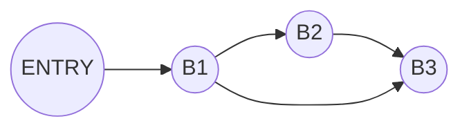

# Lab4.1 实验报告

## 实验要求

- 阅读附件，理解SSA形式及其实现方法
- 阅读 Mem2Reg.cpp 和 Dominators.cpp 两段代码，理解 SSA 实际实现过程中的细节
- 运行代码观察生成的中间代码的差异

## 思考题

### Question 1

**请简述概念：支配性、严格支配性、直接支配性、支配边界**

- 支配性：在入口节点为 $b_0$ 的流图中，当且仅当 $b_i$ 位于从 $b_0$ 到 $b_j$ 的每条路径上时，结点 $b_i$ 支配结点 $b_j$。$b_j$ 本身也支配 $b_j$
- 严格支配性：在支配性基础上，支配集不包含自身节点的其他所有节点具有严格支配性。即 $b_i \in Dom(b_j) - \{ b_j \}$ 时，$b_i$ 严格支配 $b_j$
- 直接支配性：当 $b_i$ 是 $b_j$ 的严格支配集中与 $b_j$ 最近的结点时，$b_i$ 为 $b_j$ 的直接支配结点，记作 $IDom(b_j)$。流图的入口结点没有直接支配结点。
- 支配边界：将相对于 $b_i$ 拥有以下两种性质的节点 $b_j$ 的集合称为支配边界，记为 $DF(b_i)$。
  (1) $b_i$ 支配 $b_j$ 的一个前驱（$q \in preds (b_j)$ 且 $b_i \in Dom(q)$）
  (2) $b_i$ 并不严格支配 $b_j$
  一般来说，$DF(b_i)$ 就是在离开 $b_i$ 的每一条CFG路径上，从节点 $b_i$ 可达但并不支配的第一个节点

### Question 2

**`phi`节点是SSA的关键特征，请简述phi节点的概念，以及引入`phi`节点的理由**

`phi`节点出现在CFG代码路径的汇合处，表现为`phi`函数的形式。`phi`函数的定义要求位于程序块顶部的所有`phi`函数并发执行。

朴素算法会在每个汇合节点起开始为每个变量放上一个`phi`函数。而在有了支配边界之后，若基本块B中定义了x，则要求
$DF(x)$ 集合中的每个起始节点都放置一个对应x的`phi`函数。

引入`phi`节点的目的在于辅助SSA进行代码的优化，同时他本身也可以优化一些 load/store 指令。具体来说，在进行了SSA的基础上，各个代码块中的静态单变量形式名都不相同，因此在代码路径交汇点的位置上需要进行变量的调和，以顺利输入下一个代码块中，`phi`节点扮演了调和的角色。

### Question 3

**观察下面给出的cminus程序对应的 LLVM IR，与开启Mem2Reg生成的LLVM IR对比，每条 load, store 指令发生了变化吗？变化或者没变化的原因是什么？请分类解释**

首先看`func`函数代码块：

```cpp
int func(int x){
    if(x > 0){
        x = 0;
    }
    return x;
}
```

相关代码块的流图如下：



首先就是对于输入参数的的优化，这里不需要重新申请空间去储存并读取参数了，而是直接使用传入的参数，store 指令和 load 指令各省一条。

```llvm
define i32 @func(i32 %arg0) {
label_entry:
  %op3 = icmp sgt i32 %arg0, 0
  %op4 = zext i1 %op3 to i32
  %op5 = icmp ne i32 %op4, 0
  br i1 %op5, label %label6, label %label7
```

```llvm
define i32 @func(i32 %arg0) {
label_entry:
  %op1 = alloca i32 <--modified
  store i32 %arg0, i32* %op1 <--modified
  %op2 = load i32, i32* %op1 <--modified
  %op3 = icmp sgt i32 %op2, 0
  %op4 = zext i1 %op3 to i32
  %op5 = icmp ne i32 %op4, 0
  br i1 %op5, label %label6, label %label7
```

之后就是在 B3 前插入了`phi`节点，省去了一条 store 指令和一条 load 指令

```llvm
label6:                                           
  br label %label7
label7:                                           
  %op9 = phi i32 [ %arg0, %label_entry ], [ 0, %label6 ]
  ret i32 %op9
```

```llvm
label6:                                          
  store i32 0, i32* %op1
  br label %label7
label7:                                           
  %op8 = load i32, i32* %op1
  ret i32 %op8
```

这里`phi`节点语句表示，如果是从`%label_entry`进入了`label7`，那么取值就是`%arg0`；如果是从`label6`进入的`label7`，那么取值就是0

之后观察主函数代码块：

```cpp
int main(void){
    int arr[10];
    int b;
    globVar = 1;
    arr[5] = 999;
    b = 2333;
    func(b);
    func(globVar);
    return 0;
}
```

整个函数没有分块（不计算判断数组异常的块），这里的优化主要在于变量 b。

```llvm
%op5 = getelementptr [10 x i32], [10 x i32]* %op0, i32 0, i32 5
store i32 999, i32* %op5
%op7 = call i32 @func(i32 2333)
%op8 = load i32, i32* @globVar
%op9 = call i32 @func(i32 %op8)
ret i32 0
```

```llvm
%op5 = getelementptr [10 x i32], [10 x i32]* %op0, i32 0, i32 5
store i32 999, i32* %op5
store i32 2333, i32* %op1 <--modified
%op6 = load i32, i32* %op1 <--modified
%op7 = call i32 @func(i32 %op6) <--modified
%op8 = load i32, i32* @globVar
%op9 = call i32 @func(i32 %op8)
ret i32 0
```

通过分析检测出变量`b`在整个块内都是一个定值，因此省去为`b`开辟存储空间，直接储存`b`的定值（2333），直接在调用时输入定值从而减少了一条 load 以及一条 store 指令

除此之外，没有其他变量被优化

### Question 4

**指出放置`phi`节点的代码，并解释是如何使用支配树的信息的。（需要给出代码中的成员变量或成员函数名称）**

放置`phi`节点的中间代码如下：

```llvm                                        
%op9 = phi i32 [ %arg0, %label_entry ], [ 0, %label6 ]
```

实现这个步骤的函数如下：

```cpp
Mem2Reg::generate_phi()
```

放置`phi`节点时，使用支配树信息的代码如下：

```cpp
std::map<std::pair<BasicBlock *, Value *>, bool> bb_has_var_phi; // bb has phi for var
for (auto var : global_live_var_name) {
    std::vector<BasicBlock *> work_list;
    work_list.assign(live_var_2blocks[var].begin(), live_var_2blocks[var].end());
    for (int i = 0; i < work_list.size(); i++) {
        auto bb = work_list[i];
        for (auto bb_dominance_frontier_bb : dominators_->get_dominance_frontier(bb)) {
            if (bb_has_var_phi.find({bb_dominance_frontier_bb, var}) == bb_has_var_phi.end()) {
                // generate phi for bb_dominance_frontier_bb & add bb_dominance_frontier_bb to work list
                auto phi =
                    PhiInst::create_phi(var->get_type()->get_pointer_element_type(), bb_dominance_frontier_bb);
                phi->set_lval(var);
                bb_dominance_frontier_bb->add_instr_begin(phi);
                work_list.push_back(bb_dominance_frontier_bb);
                bb_has_var_phi[{bb_dominance_frontier_bb, var}] = true;
            }
        }
    }
}
```

这里在插入`phi`节点时利用了支配树信息`get_dominance_frontier(bb)`，即当前块的支配边界。对`bb`支配边界中的所有块中，首先获取并定义`phi`节点相关信息，在块起始处插入相应的`phi`节点，并将`bb_dominance_frontier_bb`入栈`work_list`方便后续删除 load 和 store 指令，最后把相应信息存入`bb_has_var_phi`中。利用支配边界去插入`phi`节点，有效减少了冗余`phi`节点的插入，提高了代码效率

### Question 5

**算法是如何选择value(变量最新的值)来替换load指令的？（描述清楚对应变量与维护该变量的位置）**

相应代码如下：

```cpp
// 步骤三：将 phi 指令作为 lval 的最新定值，lval 即是为局部变量 alloca 出的地址空间
for (auto &instr1 : bb->get_instructions()) {
    auto instr = &instr1;
    if (instr->is_phi()) {
        auto l_val = static_cast<PhiInst *>(instr)->get_lval();
        var_val_stack[l_val].push_back(instr);
    }
}

for (auto &instr1 : bb->get_instructions()) {
  auto instr = &instr1;
  // 步骤四：用 lval 最新的定值替代对应的load指令
  if (instr->is_load()) {
      auto l_val = static_cast<LoadInst *>(instr)->get_lval();

      if (!IS_GLOBAL_VARIABLE(l_val) && !IS_GEP_INSTR(l_val)) {
          if (var_val_stack.find(l_val) != var_val_stack.end()) {
              // 此处指令替换会维护 UD 链与 DU 链
              instr->replace_all_use_with(var_val_stack[l_val].back());
              wait_delete.push_back(instr);
          }
      }
  }
  // 步骤五：将 store 指令的 rval，也即被存入内存的值，作为 lval 的最新定值
  if (instr->is_store()) {
      auto l_val = static_cast<StoreInst *>(instr)->get_lval();
      auto r_val = static_cast<StoreInst *>(instr)->get_rval();

      if (!IS_GLOBAL_VARIABLE(l_val) && !IS_GEP_INSTR(l_val)) {
          var_val_stack[l_val].push_back(r_val);
          wait_delete.push_back(instr);
      }
  }
}
```

可以看到首先将代码块中的所有代码遍历一遍，对于使用了`phi`指令作为`lval`的最新定值的指令，都会放入`var_val_stack[l_val]`栈中。另外还有一种关于取得`lval`的最新定值的方式，即相应的 store 指令的`rval`，这里获取方式同样是将相应值压入栈。需要进行注意的是，上述步骤无法处理指针以及全局变量。在后面的步骤中，就可以根据栈进行 load 指令的替换，即使用这条语句`instr->replace_all_use_with(var_val_stack[l_val].back())`。最后只需要标记 load 指令方便最后进行删除即可。

### 代码阅读总结

- 进一步对伪代码加深了理解
- 看到了更多关于cpp的神奇用法
- 进一步理解了SSA是怎样进行中间代码优化的
- 对于某些操作有了更好的思路（比如先对所有指令进行标记，之后全部进行删除，而不是一边找一边删，导致处理很多的情况）

### 实验反馈 （可选 不会评分）

感觉还是可以加一点实际的操作进去
