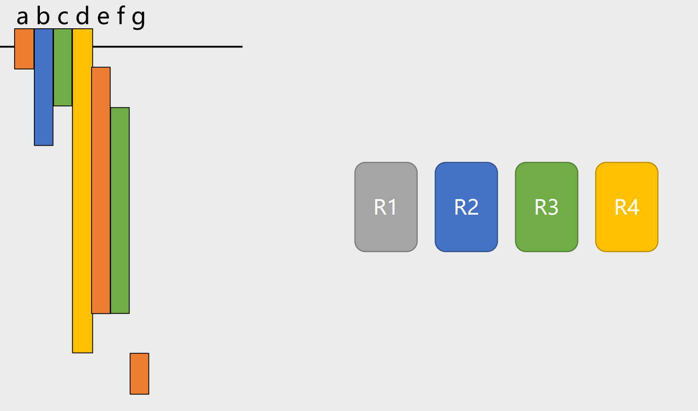

# Lab5 实验报告

姓名：陈奕衡
学号：PB20000024

## 实验要求

根据中间代码，生成相应的汇编代码

## 实验设计

### def-use 链设计与全局变量

数据结构如下，各部分均在不同阶段起到不同的作用。

```
struct duChain {
    Value *leader_;
    postion *def_;
    std::set<postion *> use_;
    int regnum;
    int offset;
    int realoffset;
    int end;
    bool is_arg;
    bool is_global;

    duChain() : leader_{}, def_{}, use_{} {}

    bool operator==(const duChain &other) const {return this->leader_ == other.leader_;}
};
```

### 活跃变量分析

面对 ssa 结构的中间代码进行处理，因此各种变量均以递增的方式出现。因此只需要遍历一遍指令即可获得以起点（即[i,j]中的i）递增的顺序排列的活跃区间列表。

```
for all succ_basicblock
    if (find phi) then 
        set use for the variable
        use->insnum_ = the last instruction in basicblock
```

### 寄存器分配

这里采用了Poletto版本的线性扫描策略，对于 phi 指令同 lab4 一样进行了 copystatment 操作。



### 指令翻译

#### 二元运算指令

面对 GVN 优化下的代码，在有着常数传播的前提下，不存在常数加常数的情况。大概思路如下：

```
for operands in instruction
    if contant then 
        get contant as str_con
    else 
        get allocated reg as str_reg
get str_dest_reg
output(op + str_dest_reg + str_con1 | str_reg1 + str_con2 | str_reg2)
```

#### 比较运算指令

考虑到比较运算指令与分支跳转指令同时出现，所以同时进行处理以对应相应的汇编指令。并由此进行一点指令压缩。

```
get op0 to $r23
get op1 to $r24
str_dest_reg = 1
output(br + op + $r23 + $r24 + trueBB)
str_dest_reg = 0
output(br + falseBB)
```

#### 函数调用

函数调用需要考虑对于寄存器的保存与读取。通过 du 链的 offset 项可以计算出每个变量在栈上的存储位置

```
save allocated reg
save arg reg
call(func)
set return value 
load arg reg
load allocated reg
```

#### 访存操作

访存操作主要是对于三个指令的处理，就是 gep, load, store。

gep:

```
if global or pointer
    find base 
else 
    set base as $fp - du->offset (找到arr[0])

if offset is computable
    du->realoffset = result 
else 
    output(calculate steps)
```

load:

```
if du->realoffset then
    load value in fp + du->realoffset to reg 
else 
    load value in fp + gep_reg
```

store:

```
if du->realoffset then
    store value in reg to fp + du->realoffset 
else 
    store value in reg to fp + gep_reg
```

## 实验难点

### 立即数计算

由于大部分指令只支持 12 位立即数，因此需要对于大立即数使用 lui 指令搬运进寄存器中进行计算

```
lu12i.w dest_reg (num - num % 4096 >> 12)
ori dest_reg dest_reg num % 4096
```

单精度浮点数使用上述方法会出现问题，因此学用了网站上的办法使用 .word 存储

- 栈空间计算

这里使用 alloca 指令以及相应框架进行整体的空间处理

```
emitcode() 
    process global 
    process arg

    calculate total space use

    process instructions

```

- 指针传递

指针传递主要的问题是指针以 8 字节存储，是唯一的需要进行 8 字节运算的指令

## 实验总结

这个实验整体思路上不难，但是各种细节上存在着能够在 debug 的时候抓狂的点。

